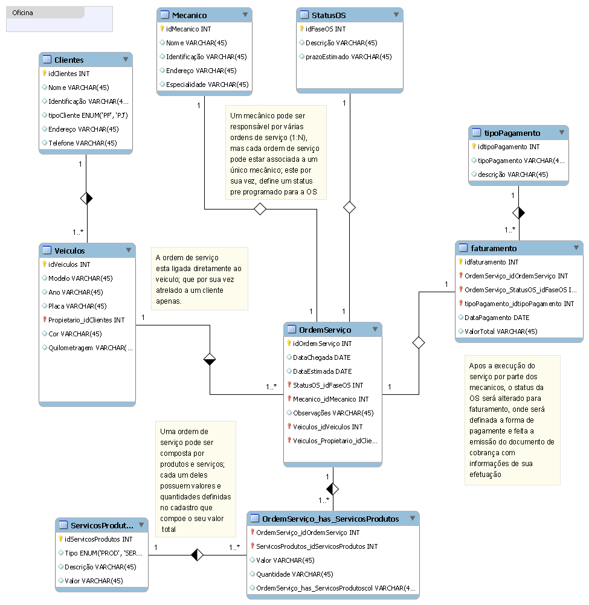

# Desafio de Projeto: Construindo um Esquema Conceitual para Banco De dados

## Descrição do Projeto

Este projeto faz parte do "Desafio de Projeto: Construindo um Esquema Conceitual para Banco De dados - Oficina". O objetivo é criar do zero um modelo conceitual de banco de dados para um sistema de Oficinas, aplicando boas práticas de modelagem e atendendo os direcionamentos do solicitante.

## Estrutura do Banco de Dados

O banco de dados foi modelado para atender às necessidades de um sistema de Oficinas, incluindo entidades como Cliente, Veiculos, Ordem de Serviço, Forma de Pagamento, Faturamento, entre outras. A estrutura foi projetada para ser flexível e eficiente, permitindo a gestão de clientes, Ordens de serviços, Mecanicos responsáveis e pagamentos de forma integrada.

## Desafio
Cria o esquema conceitual para o contexto de oficina com base na narrativa fornecida

Narrativa:
Sistema de controle e gerenciamento de execução de ordens de serviço em uma oficina mecânica
Clientes levam veículos à oficina mecânica para serem consertados ou para passarem por revisões  periódicas
Cada veículo é designado a uma equipe de mecânicos que identifica os serviços a serem executados e preenche uma OS com data de entrega.
A partir da OS, calcula-se o valor de cada serviço, consultando-se uma tabela de referência de mão-de-obra
O valor de cada peça também irá compor a OSO cliente autoriza a execução dos serviços
A mesma equipe avalia e executa os serviços
Os mecânicos possuem código, nome, endereço e especialidade
Cada OS possui: n°, data de emissão, um valor, status e uma data para conclusão dos trabalhos.

## AÇÕES

Criado do zero, utilizei todas as especificações da narrativa pra poder basear este esquema; acredito está bem completo conforme o proposto.

## Aprendizados

- Organização das Entidades e Atributos
- Relacionamentos e Cardinalidades
- Identificação de Chaves Primárias e Estrangeiras
- Modelagem de Processos de Negócio
- Ferramentas de Modelagem: Testei varias, mas com foco no workbench

## Melhorias Futuras

Iteração e Revisão: O processo de criar e revisar diagramas incentiva a melhoria contínua, onde você pode iterar sobre o design e ajustar conforme necessário.
Feedback: Receber feedback de colegas e stakeholders ajuda a identificar áreas de melhoria que você pode não ter percebido inicialmente.
